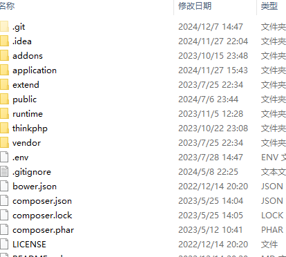
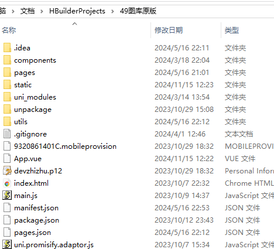

[六合彩图库源码49图库源码](https://www.tuku325.cc/?tags=56) 是一款基于 PHP+vue开发的 前后端分离的六合彩图库系统；前端基于uniapp平台，可打包49图库app，49图库网站等多个平台；后端基于 ThinkPHP+Bootstrap的极速后台开发框架，可实现各种二次开发功能。
[搭建49图库](https://www.tuku325.cc/) 请认准官网：https://www.tuku325.cc/

## 六合彩图库源码49图库源码目录结构

## 六合彩图库源码49图库源码后端说明
- 1、基于ThinkPHP5，初始绑定的域名是www.tuku325.cc，自行修改成自己要绑定的域名，以下说明如果遇到www.tuku325.cc请修改成自己的域名
- 2、PHP+Mysql+Redis
- 3、后台入口 https://域名/8888.php，初始后台入口8888.php；账号admin，密码123456；

## 搭建六合彩图库49图库后台功能说明
- 1、支持私彩开奖，自定义号码开奖
- 2、支持自动生成私彩资料，论坛资料，自动对错
- 3、图库所有功能如：论坛，资料大全，图库，站外链接，会员中心等在后台都有对应功能；都可以在后台进行增删改查操作
- 4、私彩可以自动生成图纸
- 5、私彩可以自动合成开奖视频MP4
- 6、官方彩澳门、香港、新加坡、台湾 可以自动采集开奖结果和历史记录
- 7、后台支持二次开发

## 49图库后台主要特性

* 基于`Auth`验证的权限管理系统
    * 支持无限级父子级权限继承，父级的管理员可任意增删改子级管理员及权限设置
    * 支持单管理员多角色
    * 支持管理子级数据或个人数据
* 强大的一键生成功能
    * 一键生成CRUD,包括控制器、模型、视图、JS、语言包、菜单、回收站等
    * 一键压缩打包JS和CSS文件，一键CDN静态资源部署
    * 一键生成控制器菜单和规则
    * 一键生成API接口文档
* 完善的前端功能组件开发
    * 基于`AdminLTE`二次开发
    * 基于`Bootstrap`开发，自适应手机、平板、PC
    * 基于`RequireJS`进行JS模块管理，按需加载
    * 基于`Less`进行样式开发
* 强大的插件扩展功能，在线安装卸载升级插件
* 通用的会员模块和API模块
* 共用同一账号体系的Web端会员中心权限验证和API接口会员权限验证
* 二级域名部署支持，同时域名支持绑定到应用插件
* 多语言支持，服务端及客户端支持
* 支持大文件分片上传、剪切板粘贴上传、拖拽上传，进度条显示，图片上传前压缩

## 版权信息

版权所有Copyright © 2017-2025 by Tuku325 (https://www.tuku325.cc/)

All rights reserved。
